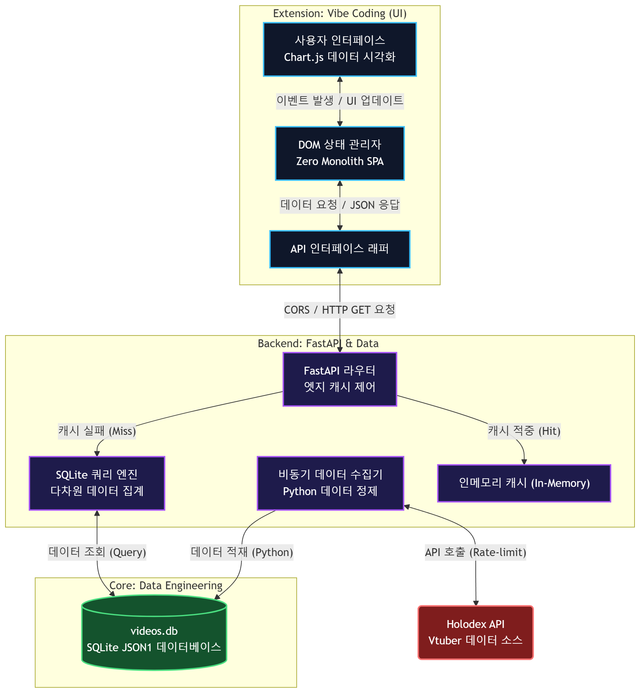

# HoloProject - Vtuber Data Explorer 

> 홀로라이브 및 개인세 버튜버 데이터 파이프라인 구축 및 동적 탐색 대시보드
> **(데이터 분석가 핵심 역량 + AI 바이브 코딩 풀스택 확장 포트폴리오)**

## 요약 파트

### 1. 프로젝트 개요
**문제 정의**
- YouTube 및 기존 Holodex 사이트의 기본 검색 기능은 '특정 멤버 간 다차원 교차 검색', '연도별/월별 콘텐츠 추이 분석' 등 심도 있는 인사이트 도출에 한계가 있음
- 데이터 분석가로서 API 기반의 대규모 Raw Data를 직접 수집 및 정제하여 독자적인 탐색 환경을 구축함

**핵심 구현 내역**
- Python 기반 데이터 파이프라인(ETL) 및 데이터 클렌징
- SQLite JSON1 하이브리드 모델링 및 SQL 다차원 집계 로직
- Vibe Coding을 활용한 Vanilla JS SPA 프론트엔드 및 FastAPI 백엔드 구축
- TDD 프로세스와 커스텀 AI 워크플로우를 강제하여 에이전트 작업 퀄리티 제어
- Railway 서버 배포 및 Cloudflare 엣지 캐싱 튜닝

### 2. 결과 및 직무에 적용할 점
- 정형화가 어려운 다차원 API 데이터를 RDBMS로 가져와 유연하게 파싱하는 **하이브리드 스키마 설계 역량**을 증명했습니다.
- 데이터 분석 결과를 단순히 리포트로 남기지 않고, 누구나 직관적으로 탐색할 수 있는 **동적 웹 대시보드로 End-to-End 배포**했습니다.
- 본업이 아닌 웹 풀스택 영역을 **Vibe Coding**으로 구현해, AI 에이전트를 활용하고 워크플로우를 구축하는 **프롬프트 엔지니어링 역량**을 확보했습니다.

### 3. 주요 액션 (시스템 아키텍처)


---

## 상세 파트

### 1. 과정 풀이 A: Data Processing & Analysis (데이터 분석 코어)

본 프로젝트의 ETL 파이프라인 구축과 다차원 SQL 집계 처리는 데이터 분석 레이어로 설계하고 구현했습니다.

- **Data Extract & Load**: Holodex API 연동 및 Rate Limit 우회를 처리하는 Python 로직 작성 (Hololive 전 멤버 + 개인세 일부 타겟팅)
- **Data Transformation**: SQLite JSON1 Extension을 활용한 하이브리드 모델링. 배열 형태로 들어오는 `mentions` 비정형 데이터를 분해하여 노드 가중치 통계로 치환
- **Data Cleansing**: 결측치(Status: missing) 및 비정상 분류 메타데이터(Shorts, Morning 등 노이즈 태그)를 소거하여 신뢰성 높은 지표 도출

**[데이터 전처리 및 분석 파이프라인 명세서 (DATA_PROCESSING_PIPELINE.md)](./docs/DATA_PROCESSING_PIPELINE.md)**

### 2. 과정 풀이 B: Vibe Coding (풀스택 서비스 배포)

분석된 데이터 인사이트를 실제 서비스로 서빙하기 위한 프론트엔드 UI, 웹 서버 배포, API 연동 등의 아키텍처는 **Vibe Coding**을 활용하여 구축했습니다. 

- **Frontend & API**: 바닐라 JS(ES6+) 기반의 상태 관리 SPA 메커니즘을 프롬프팅으로 도출하여 렌더링 최적화
- **Workflow & TDD**: `.agent/workflows` 및 `.agent/skills` 디렉터리에 AI 파이프라인(TDD 기반 개발, 코드 리뷰, 자동 배포)을 구축하여 에이전트의 작업 프로세스를 제어함
- **Deployment**: 
  - Railway 서버 배포와 Cloudflare 엣지 캐싱 구성을 Vibe Coding 지시를 통해 완수
  - 배포 환경의 콜드 스타트 지연 문제를 `Cache-Control` 헤더 제어와 JS `Promise.all` 비동기 병렬화로 해결

**[바이브 코딩 아키텍처 및 트러블슈팅 명세서 (TROUBLESHOOTING.md)](./docs/TROUBLESHOOTING.md)**

### 3. 결과 및 기대효과
- **기대효과**
  - 무거운 쿼리 없이 빠르고 직관적으로 특정 멤버/기간/유형별 버튜버 지표를 교차 탐색 가능
  - 데이터 분석가의 인사이트를 상용 서비스 환경에 즉시 배포할 수 있는 자체 엔지니어링 파이프라인 확보
  - 향후 다른 분석 도메인(게임 로그, 유저 행동 데이터 등)에도 즉시 이식 가능한 풀스택 템플릿 마련
- **한계**
  - 실시간 스트리밍 채팅 반응 등 초거대 텍스트 데이터 스트리밍 연동 부재
  - 수집된 과거 데이터의 최신화(Real-time Sync)를 위한 스케줄러 계층 부재
- **개선 방향**
  - GitHub Actions 또는 자체 서버 Cron을 활용한 자동 데이터 수집/정제 배치 적용
  - 감성 분석(Sentiment Analysis)을 활용한 시청자 채팅 긍부정 지표 확장

### 4. 사용 기술 스택
- **Data Engineering**: Python, SQLite (JSON1 Extension)
- **Frontend**: Vanilla JS (ES6+), HTML5/CSS3, Chart.js
- **Backend & Infra**: FastAPI, Uvicorn, Railway, Cloudflare
- **AI / Ops**: AI Prompt Engineering (Vibe Coding), Custom Agent Workflow (TDD)

### 5. 프로젝트 파일 및 실행법

```text
HoloProject_Portfolio/
├── data/               # SQLite DB 및 정제된 비정형 JSON 소스 
├── docs/               # 설계/분석 문서 (Data Pipeline, Troubleshooting 등)
├── public/             --- [Vibe Coding] 시각화 대시보드 리소스 (HTML/CSS)
├── src/                --- [Vibe Coding] 분리된 JS 상태 관리/UI 모듈
├── server.py           --- [Vibe Coding] 데이터 서빙 라우터 (FastAPI)
├── database.py         --- [Core Competency] 핵심 SQL 쿼리 로직 및 전처리
└── README.md
```

**실행 방법 (Local)**

1. **Python 환경 설정**
   ```bash
   pip install -r requirements.txt
   ```
2. **로컬 서버 실행**
   ```bash
   python server.py
   # 혹은 start_server_python.bat 실행
   ```
3. **대시보드 접속**
   - `http://localhost:8000` (서버 설정 포트에 따라 다름)
