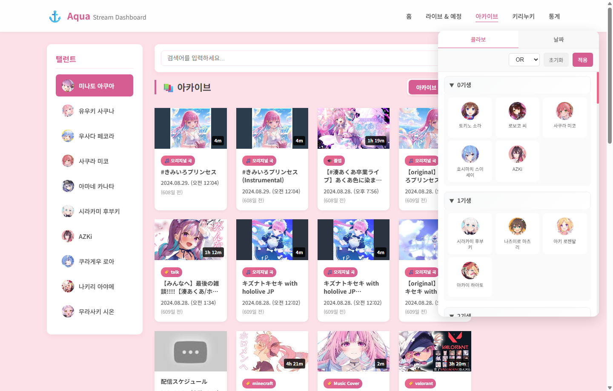
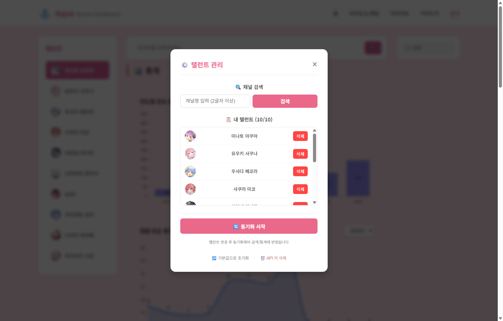
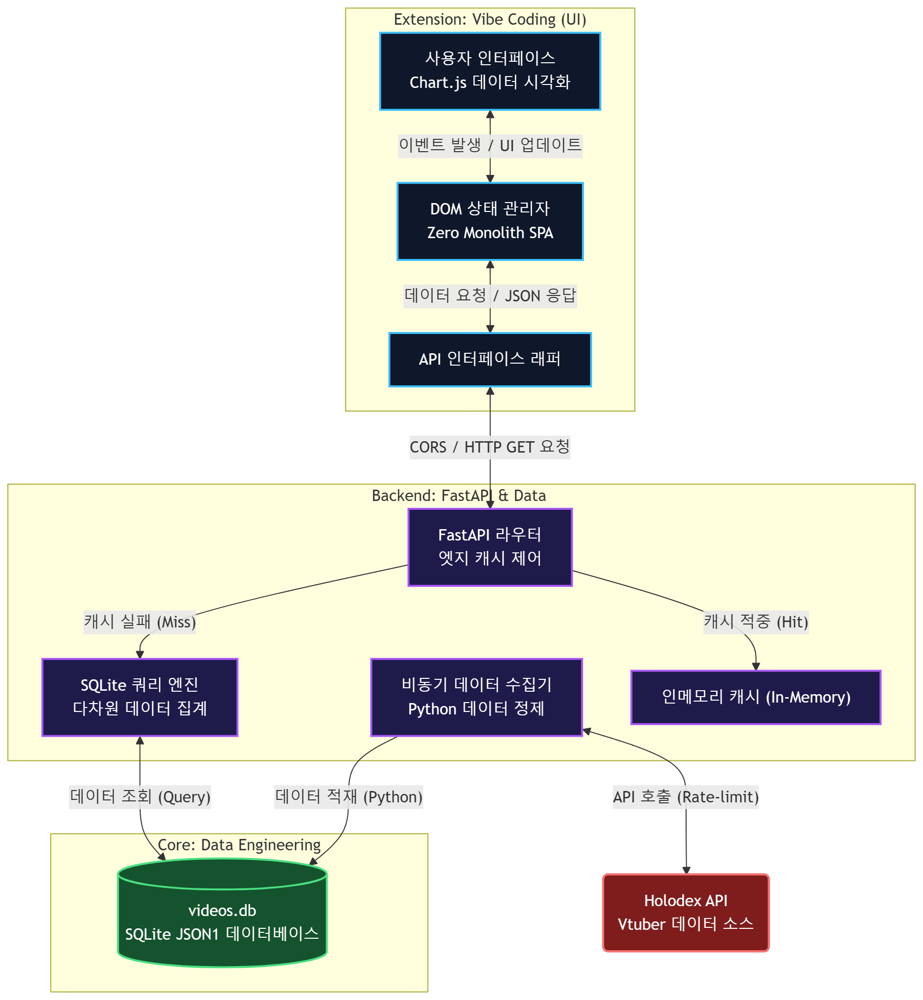

# HoloProject Vtuber Data Explorer

> Holodex API 데이터를 수집·정제해 멤버별 방송 아카이브, 콜라보 관계, 콘텐츠 추이를 탐색할 수 있게 만든 라이브 웹 서비스

- **Live Service**: [https://holo-search.xyz](https://holo-search.xyz/)
- **Project Type**: API Data Pipeline + Search Dashboard + Live Web Service
- **Core Stack**: Python, FastAPI, SQLite JSON1, Vanilla JavaScript, Chart.js, Railway, Cloudflare

---

## 구현 화면

### 1. 멤버별 대시보드 홈

선택한 탤런트의 프로필과 검색, 아카이브, 통계 진입점을 한 화면에서 확인할 수 있도록 구성


### 2. 아카이브 검색

멤버별 방송 아카이브를 카드 형태로 탐색하고, 제목·날짜·콘텐츠 태그를 기준으로 검색 가능


### 3. 콜라보 필터

특정 멤버와 함께 등장한 방송만 추려볼 수 있도록 세대별 멤버 선택과 OR/AND 필터를 제공



### 4. 방송 통계

연도별·월별 방송량, 멤버십 방송, 콜라보 Top 30, 콘텐츠 Top 10을 시각화


### 5. 탤런트 관리 및 동기화

분석 대상 채널을 사용자가 직접 조정하고, 필요한 경우 API 기반 동기화를 실행할 수 있게 구성



---

## 프로젝트 개요

Holodex는 버튜버 방송 정보를 탐색하기 좋은 공개 API와 서비스를 제공하지만, 특정 멤버를 기준으로 장기간의 방송 흐름, 콜라보 관계, 콘텐츠 주제 변화를 한 번에 비교하기에는 분석 관점의 화면이 부족했다

이 프로젝트는 공개 API에서 수집한 영상 데이터를 로컬 데이터 마트로 정리하고, 사용자가 직접 멤버와 기간, 콜라보 조건을 바꿔가며 탐색할 수 있는 웹 대시보드로 연결한 작업이다

### 문제 정의

- 기존 서비스는 개별 영상 검색에는 강하지만, 멤버별 장기 추이와 콜라보 네트워크를 함께 보기 어려움
- Holodex API 응답은 JSON 구조가 깊고 `mentions`, `topic`, `status`처럼 분석 기준이 흩어져 있어 그대로는 집계가 어려움
- 데이터 분석 결과가 CSV나 문서에만 남으면 실제 탐색 도구로 활용되기 어려움

### 해결 방향

- API 원천 데이터를 SQLite에 저장하고, JSON1 Extension으로 비정형 필드를 필요한 순간에 펼쳐 집계
- 멤버별 아카이브, 콜라보 Top 30, 연도·월별 방송 추이, 콘텐츠 Top 10을 대시보드 화면으로 구성
- FastAPI 서버와 Vanilla JavaScript SPA를 Railway에 배포하고 Cloudflare 캐싱을 적용해 실제 접속 가능한 서비스로 운영

---

## 데이터 구성

로컬 분석 기준으로 약 **10.3만 건**의 영상 데이터를 수집하고, **73개 채널**과 **617개 언급 채널 노드**를 분석 대상으로 정리했다

| 항목 | 내용 |
| --- | --- |
| 원천 데이터 | Holodex API 영상·채널·멘션 데이터 |
| 분석 단위 | video, channel, topic, mention, date |
| 저장 구조 | SQLite + JSON 원본 필드 병행 저장 |
| 주요 파생 지표 | 연도별 방송량, 월별 방송량, 멤버십 방송량, 콜라보 빈도, 콘텐츠 Top 10 |
| 서비스 제공 방식 | FastAPI API + 정적 SPA 대시보드 |

---

## 시스템 흐름



```text
Holodex API
  -> Python ETL
  -> SQLite JSON1 Hybrid Store
  -> FastAPI Search/Stats API
  -> Vanilla JS Dashboard
  -> Railway + Cloudflare Live Service
```

### 설계 포인트

- **JSON1 Hybrid Modeling**
  원본 JSON을 보존하면서 `mentions`, `topic`, `status` 같은 필드는 SQL 집계 시점에 분해해 사용

- **동적 아카이브 필터링**
  삭제·비공개·언아카이브 상태를 데이터에서 제거하지 않고, 사용자가 UI에서 숨김 여부를 조정하도록 설계

- **콜라보 네트워크 집계**
  `mentions` 배열을 기반으로 멤버 간 연결을 추출하고, 특정 멤버 기준 Top 30 콜라보 상대를 계산

- **서비스 배포 최적화**
  Railway 배포 후 Cloudflare 캐싱과 병렬 요청 구조를 적용해 초기 로딩과 반복 탐색 비용을 줄임

자세한 데이터 처리 과정은 [DATA_PROCESSING_PIPELINE.md](docs/DATA_PROCESSING_PIPELINE.md)에 정리되어 있음

---

## 주요 기능

| 기능 | 설명 |
| --- | --- |
| 멤버별 아카이브 탐색 | 탤런트를 선택해 해당 채널의 방송 아카이브를 카드 UI로 탐색 |
| 제목 검색 | 방송 제목 기반 검색으로 특정 게임·기획·키워드 방송 추출 |
| 콜라보 필터 | 함께 등장한 멤버를 기준으로 OR/AND 조건 검색 |
| 날짜 필터 | 특정 연도·월·일 단위로 방송 목록 필터링 |
| 통계 대시보드 | 연도별·월별 방송량, 멤버십 방송량, 콜라보 Top 30, 콘텐츠 Top 10 시각화 |
| 탤런트 관리 | 분석 대상 채널 추가·삭제 및 동기화 실행 |

---

## 트러블슈팅

### 1. JSON API와 관계형 집계의 충돌

Holodex API의 응답은 분석에 필요한 값이 JSON 내부에 흩어져 있었다
초기에는 모든 필드를 관계형 테이블로 펼치는 방식을 고려했지만, 스키마 변경과 필드 누락에 취약했다

최종적으로 원본 JSON은 보존하고, 필요한 분석 지점에서만 JSON1 쿼리로 펼치는 하이브리드 구조를 선택했다

### 2. 배포 환경에서 초기 로딩 지연

Railway 배포 후 API 요청이 순차적으로 발생하면서 첫 화면 로딩이 느려지는 문제가 있었다
반복 조회가 많은 정적 리소스와 API 응답에는 캐싱 전략을 적용하고, 프론트엔드에서는 `Promise.all` 기반 병렬 호출로 대기 시간을 줄였다

### 3. 대상 채널 증가에 따른 UI 복잡도

지원 멤버가 늘어날수록 모든 채널을 한 화면에 노출하면 탐색성이 떨어졌다
기본 채널 목록과 사용자 선택 채널을 분리하고, 탤런트 관리 모달에서 검색·추가·삭제할 수 있도록 구조를 바꿨다

자세한 문제 해결 기록은 [TROUBLESHOOTING.md](docs/TROUBLESHOOTING.md)에 정리되어 있음

---

## 기술 스택

| 영역 | 사용 기술 |
| --- | --- |
| Data Pipeline | Python, Holodex API, SQLite JSON1 |
| Backend | FastAPI, Uvicorn, ORJSONResponse, httpx |
| Frontend | HTML, CSS, Vanilla JavaScript, Chart.js |
| Deployment | Railway, Cloudflare |
| Workflow | Git, API Debugging, AI-assisted Coding, Codex |

---

## 프로젝트 파일 및 실행법

### 서비스 코드 및 실행

```text
HoloProject_Portfolio/
├── server.py              # FastAPI 서버 및 Holodex API 프록시
├── database.py            # SQLite 검색·통계 쿼리
├── app.js                 # SPA 화면 상태와 주요 UI 로직
├── api.js                 # 클라이언트 API 호출 모듈
├── src/                   # 상태, UI, 데이터 모듈
├── public/                # 정적 리소스
├── docs/                  # 데이터 처리 및 트러블슈팅 문서
└── requirements.txt       # Python 서버 의존성
```

```bash
pip install -r requirements.txt
uvicorn server:app --host 0.0.0.0 --port 8000 --reload
```

접속

```text
http://localhost:8000/
```

배포 환경에서는 Railway의 `$PORT`를 사용하도록 `Procfile`에 다음 명령을 지정했다

```bash
uvicorn server:app --host 0.0.0.0 --port $PORT
```

---

## 포트폴리오 관점의 의미

이 프로젝트는 단순히 API를 호출해 목록을 보여주는 수준이 아니라, 공개 API 원천 데이터를 분석 가능한 구조로 바꾸고 실제 사용자가 탐색할 수 있는 서비스까지 연결한 작업이다

데이터 분석 관점에서는 JSON 기반 비정형 데이터를 집계 가능한 마트로 정리한 경험을 보여주고, 서비스 구현 관점에서는 분석 결과를 웹 대시보드와 라이브 배포까지 확장한 과정을 보여준다
