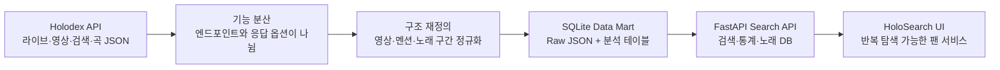
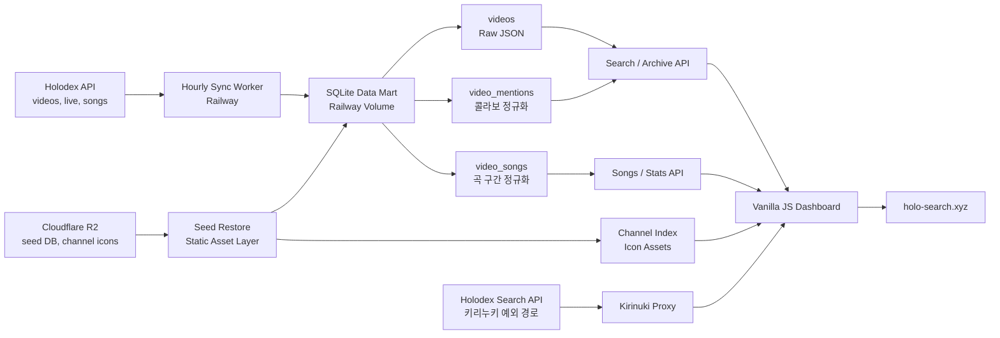
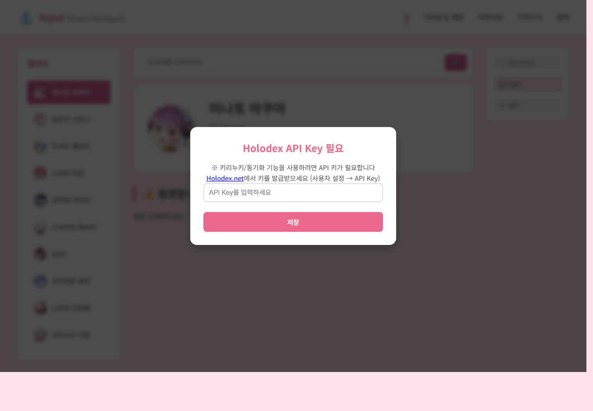
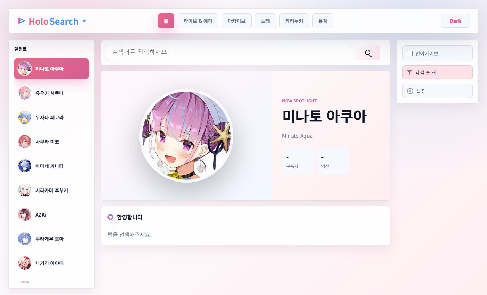
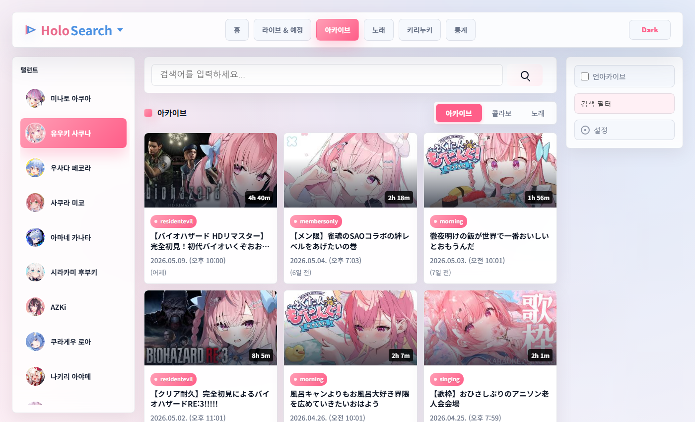
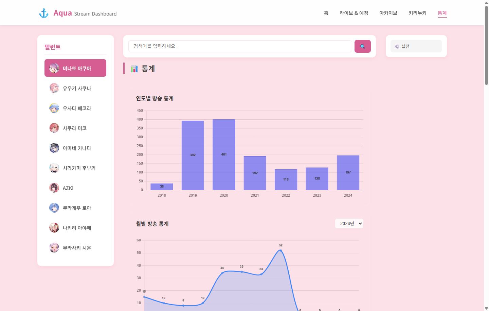

# HoloProject Vtuber Data Explorer

> Holodex API의 라이브, 아카이브, 키리누키, 노래 메타데이터를 **검색 가능한 로컬 데이터 마트**로 재구성하고, 멤버별 방송 흐름과 콘텐츠 관계를 탐색 가능한 라이브 서비스로 연결한 프로젝트

- Live Service: [https://holo-search.xyz](https://holo-search.xyz/)

## 이 프로젝트가 답하려 한 질문

Holodex는 버튜버 방송 정보를 찾기 좋은 API와 서비스를 제공합니다. 다만 실제 사용자가 원하는 흐름은 단순한 영상 조회 하나로 끝나지 않습니다. 라이브와 예정 방송을 보고, 지나간 아카이브를 조건별로 찾고, 키리누키 언어를 골라 보고, 노래 DB와 통계까지 한 화면에서 이어서 탐색하려면 여러 API 엔드포인트와 응답 옵션을 하나의 기준으로 묶어야 했습니다.

이 프로젝트는 “Holodex API를 호출해 화면에 보여주는 서비스”가 아니라 **외부 API의 비정형 데이터를 로컬 DB와 검색 API로 재구성해, 같은 조건을 반복 탐색할 수 있는 팬용 데이터 서비스**를 만드는 것을 목표로 했습니다.

| 핵심 관점 | 정리 |
| --- | --- |
| 기존 서비스의 강점 | 개별 영상 검색, 라이브 상태 확인, Musicdex 기반 곡 메타데이터 |
| 분석상의 공백 | 멤버별 장기 흐름, 콜라보 관계, 키리누키 언어 필터, 노래 구간 탐색을 한 서비스에서 연결하기 어려움 |
| 구조 선택 | Holodex API 직접 노출 대신 FastAPI + SQLite 기반 로컬 데이터 마트 |
| 데이터 규모 | 약 12.4만 건 영상, 5.3만 건 노래 구간, 1,100개 이상 멘션 채널 노드 |
| 결과물 | Railway에 배포된 FastAPI + Vanilla JS 기반 라이브 웹 서비스 |

## 문제 정의


```mermaid
flowchart LR
    A["Holodex API<br/>라이브·영상·검색·곡 JSON"] --> B["기능 분산<br/>엔드포인트와 응답 옵션이 나뉨"]
    B --> C["구조 재정의<br/>영상·멘션·노래 구간 정규화"]
    C --> D["SQLite Data Mart<br/>Raw JSON + 분석 테이블"]
    D --> E["FastAPI Search API<br/>검색·통계·노래 DB"]
    E --> F["HoloSearch UI<br/>반복 탐색 가능한 팬 서비스"]
```

## 기획과 판단 기준

처음에는 프론트엔드에서 Holodex API를 직접 호출하는 방식도 가능했습니다. 하지만 라이브, 영상 목록, 키리누키 검색, 곡 정보는 필요한 엔드포인트와 인증 방식이 다르고, API Key 유무나 Rate Limit에 따라 사용자마다 결과가 흔들릴 수 있었습니다. 그래서 공용 기능은 서버 환경변수의 Holodex API Key로 처리하고, 검색과 통계는 SQLite에 적재한 데이터를 기준으로 제공하는 구조를 선택했습니다.

데이터 모델도 전부 관계형 테이블로 펼치지 않았습니다. Holodex 응답은 `mentions`, `songs`, `topic_id`, 상태값처럼 분석에 중요한 정보가 JSON 안에 섞여 있습니다. 원본 JSON은 그대로 보존하되, 반복 조회가 필요한 멘션과 노래 구간은 `video_mentions`, `video_songs` 테이블로 분리했습니다. 이 방식으로 API 변경에 대응할 유연성과 검색 성능을 동시에 확보했습니다.

운영 단계에서 가장 크게 바뀐 판단은 **API 과다 호출을 줄이기 위해 키리누키 검색을 제외한 핵심 기능을 DB 기반으로 분리한 것**입니다. 라이브/예정, 아카이브, 노래 DB, 통계, 채널 인덱스는 서버가 주기적으로 동기화한 SQLite 데이터를 읽고, 키리누키만 언어 조합과 최신 검색성이 중요해 Holodex 검색 API를 실시간으로 사용합니다. 대용량 seed DB와 채널 아이콘 같은 정적 리소스는 Cloudflare R2 같은 object storage로 빼서, Git 저장소와 Railway 런타임에 무거운 파일을 직접 싣지 않도록 설계했습니다.

## 설계 기준

| 판단 지점 | 선택한 기준 | 이유 |
| --- | --- | --- |
| API 호출 방식 | 서버 프록시 + 로컬 DB 병행 | 라이브/예정은 최신성이 중요하고, 아카이브/통계는 재현성이 중요하기 때문 |
| API 호출 절감 | 키리누키를 제외한 주요 기능은 DB 조회 우선 | 같은 채널/페이지를 볼 때마다 Holodex API를 반복 호출하지 않기 위해 |
| 자동 갱신 | Railway 서버에서 1시간 주기 증분 동기화 | 사용자가 수동으로 API Key를 넣지 않아도 데이터가 유지되도록 설계 |
| 저장 구조 | SQLite + Raw JSON + 정규화 테이블 | 원본 보존, 검색 성능, API 변경 대응을 모두 만족하기 위해 |
| 대용량 리소스 분리 | seed DB와 채널 아이콘을 R2/object storage로 분리 | 배포 크기와 런타임 디스크 부담을 줄이고, 장애 시 빠르게 복구하기 위해 |
| 콜라보 필터 | `video_mentions` 기반 OR/AND 검색 | 단순 mentions 표시가 아니라 멤버 간 관계 탐색이 가능하도록 |
| 키리누키 필터 | Holodex 검색 API의 언어 조건 사용 | 일본어, 한국어, 영어, 중국어 클립을 사용자가 직접 조합해 볼 수 있도록 |
| 노래 DB | Holodex/Musicdex `songs` 메타데이터 적재 | 방송 내 곡 구간을 검색하되, 자체 음원 인식이 아니라 원천 메타데이터를 신뢰 |
| 성능 기준 | 인덱스, 페이지네이션, 채널 인덱스 캐시 | 수십만 건 규모의 SQLite 조회를 브라우저에서 체감 가능하게 유지 |

## 데이터 흐름


```mermaid
flowchart LR
    A["Holodex API<br/>videos, live, songs"] --> B["Hourly Sync Worker<br/>Railway"]
    B --> C["SQLite Data Mart<br/>Railway Volume"]
    C --> D["videos<br/>Raw JSON"]
    C --> E["video_mentions<br/>콜라보 정규화"]
    C --> F["video_songs<br/>곡 구간 정규화"]
    R["Cloudflare R2<br/>seed DB, channel icons"] --> S["Seed Restore<br/>Static Asset Layer"]
    S --> C
    S --> I["Channel Index<br/>Icon Assets"]
    D --> G["Search / Archive API"]
    E --> G
    F --> H["Songs / Stats API"]
    K["Holodex Search API<br/>키리누키 예외 경로"] --> L["Kirinuki Proxy"]
    G --> U["Vanilla JS Dashboard"]
    H --> U
    I --> U
    L --> U
    U --> V["holo-search.xyz"]
```

이 흐름에서 핵심은 조회 경로를 둘로 나눈 점입니다. 아카이브, 라이브/예정, 노래, 통계, 채널 아이콘은 DB와 정적 리소스 계층에서 읽어 API 호출을 줄이고, 키리누키는 Holodex의 언어 필터 검색 기능을 그대로 활용합니다. 즉 사용자는 별도 API Key가 없어도 대부분의 화면을 사용할 수 있고, 운영자는 R2에 올린 seed DB와 아이콘 리소스로 배포와 복구를 단순화할 수 있습니다.

## 차별점

| 기존 접근의 한계 | 이 프로젝트의 관점 |
| --- | --- |
| Holodex 기능이 여러 엔드포인트와 옵션으로 나뉘어 있음 | 라이브, 아카이브, 키리누키, 노래 DB, 통계를 하나의 탐색 UI로 통합 |
| 사용자가 화면을 열 때마다 외부 API를 호출하면 Rate Limit과 응답 지연이 누적됨 | 키리누키를 제외한 기능을 DB 기반으로 전환해 반복 조회 비용을 서버 내부 조회로 흡수 |
| API 응답을 바로 화면에 보여주면 인증과 시점에 따라 결과가 흔들릴 수 있음 | 서버 환경변수 API Key와 로컬 SQLite를 사용해 공용 기능의 재현성 확보 |
| seed DB와 아이콘을 앱 저장소에 직접 묶으면 배포가 무거워지고 복구가 느려짐 | Cloudflare R2/object storage에 대용량 리소스를 분리해 배포물은 가볍게 유지 |
| 깊은 JSON 구조를 매번 파싱하면 검색과 통계 쿼리가 복잡해짐 | Raw JSON은 보존하고 멘션/노래 구간은 별도 테이블로 정규화 |
| 영상별 mentions만 보면 콜라보 흐름을 파악하기 어려움 | 멤버 기준 콜라보 OR/AND 필터와 통계 API로 관계 탐색을 지원 |
| 키리누키 언어 필터는 단일 언어 선택에 머무르기 쉬움 | 선택한 언어 조합을 Holodex 쿼리에 반영해 포함 조건으로 검색 |
| 노래 데이터는 최신 곡목 반영이 원천 서비스 정리에 의존함 | Musicdex/Holodex songs 메타데이터가 붙으면 다음 자동 동기화에서 DB에 반영 |

## 구현 화면

| 라이브 서비스 홈 | 멤버별 홈 |
| --- | --- |
|  |  |

| 아카이브 검색 | 방송 통계 |
| --- | --- |
|  |  |

현재 서비스는 위 기본 화면에 더해 라이브/예정 탭, 키리누키 언어 필터, 노래 DB, 탤런트 관리, 언아카이브 숨김, 날짜/연월 필터를 제공합니다. 화면에서 보이는 채널 아이콘과 채널 인덱스는 정적 리소스 계층으로 분리해 로딩 부담을 줄였고, 영상 목록과 통계는 Holodex API를 직접 반복 호출하지 않고 DB-backed API에서 내려줍니다.

## 산출물

| 항목 | 경로 |
| --- | --- |
| 데이터 처리 문서 | [DATA_PROCESSING_PIPELINE.md](docs/DATA_PROCESSING_PIPELINE.md) |
| 문제 해결 기록 | [TROUBLESHOOTING.md](docs/TROUBLESHOOTING.md) |
| 서버 코드 | `server.py`, `database.py` |
| 프론트 코드 | `app.js`, `api.js`, `src/`, `public/src/` |
| 정규화 데이터 레이어 | `videos`, `video_mentions`, `video_songs` |
| DB 기반 조회 API | `/api/search`, `/api/songs`, `/api/stats/*`, `/api/channel-index` |
| 실시간 예외 API | 키리누키 검색용 Holodex search proxy |
| R2/object storage 운영 자산 | `SEED_DB_URL` seed DB, 채널 아이콘 정적 리소스 |
| 배포 설정 | `Procfile`, `requirements.txt` |
| 운영 서비스 | [https://holo-search.xyz](https://holo-search.xyz/) |

## 한계와 다음 개선

- 노래 DB는 Holodex/Musicdex의 `songs` 메타데이터에 의존하므로, 원천 서비스에서 곡목이 늦게 붙으면 우리 서비스 반영도 늦어질 수 있음
- 현재 증분 동기화는 최신 페이지 중심으로 동작하므로, 오래된 영상에 뒤늦게 추가되는 곡 메타데이터를 더 안정적으로 회수하는 보강이 필요함
- 키리누키 검색은 Holodex 검색 API와 사용자 API Key 정책의 영향을 받으므로, 서버 캐시와 사용자 안내를 더 정교하게 다듬을 여지가 있음
- 다음 단계에서는 최근 singing 영상 재조회 큐, 콜라보 네트워크 시각화, 노래 구간 자체 파싱 보조 기능을 추가할 수 있음

## 실행 방법

```bash
pip install -r requirements.txt
uvicorn server:app --host 0.0.0.0 --port 8000 --reload
```

```text
http://localhost:8000/
```

운영 환경에서는 아래 환경변수를 사용합니다.

```text
HOLODEX_API_KEY=...
AUTO_SYNC_ENABLED=true
AUTO_SYNC_INTERVAL_SECONDS=3600
STATIC_DIR=public
```
