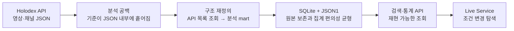
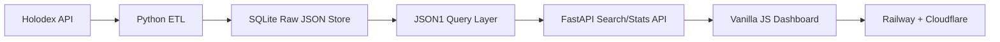

# HoloProject Vtuber Data Explorer

> Holodex API의 비정형 JSON 데이터를 **분석 가능한 로컬 마트**로 재구성하고, 멤버별 방송 흐름과 콜라보 관계를 탐색 가능한 라이브 서비스로 연결한 프로젝트

- Live Service: [https://holo-search.xyz](https://holo-search.xyz/)

## 이 프로젝트가 답하려 한 질문

Holodex는 버튜버 방송 정보를 검색하기 좋은 공개 API와 서비스를 제공합니다. 하지만 개별 영상 검색에 강한 서비스와, 멤버별 장기 흐름을 비교하는 분석 도구는 목적이 다릅니다. 특정 멤버가 어떤 콘텐츠를 많이 했는지, 누구와 자주 콜라보했는지, 방송량이 어느 시기에 달라졌는지를 한 화면에서 비교하려면 API 응답을 그대로 보여주는 것만으로는 부족했습니다.

이 프로젝트는 “API 데이터를 화면에 뿌리는 서비스”가 아니라 **비정형 JSON을 재사용 가능한 분석 구조로 바꾸고, 사용자가 조건을 바꿔 다시 탐색할 수 있게 만드는 것**을 목표로 했습니다.

| 핵심 관점 | 정리 |
| --- | --- |
| 기존 서비스의 강점 | 개별 영상 검색과 기본 메타데이터 조회 |
| 분석상의 공백 | 멤버별 장기 추이, 콜라보 관계, 콘텐츠 주제 변화를 함께 비교하기 어려움 |
| 구조 선택 | API 직접 호출 대신 SQLite + JSON1 기반 로컬 분석 mart |
| 데이터 규모 | 약 10.3만 건 영상, 73개 채널, 617개 언급 채널 노드 |
| 결과물 | FastAPI + Vanilla JS 기반 라이브 웹 서비스 |

## 문제 정의


```mermaid
flowchart LR
    A["Holodex API<br/>영상·채널 JSON"] --> B["분석 공백<br/>기준이 JSON 내부에 흩어짐"]
    B --> C["구조 재정의<br/>API 목록 조회 → 분석 mart"]
    C --> D["SQLite + JSON1<br/>원본 보존과 집계 편의성 균형"]
    D --> E["검색·통계 API<br/>재현 가능한 조회"]
    E --> F["Live Service<br/>조건 변경 탐색"]
```

## 기획과 판단 기준

처음에는 프론트엔드에서 Holodex API를 바로 호출하는 구조도 생각했습니다. 하지만 그렇게 만들면 응답 속도, Rate Limit, API Key 입력 여부에 따라 같은 조건에서도 화면 결과가 흔들릴 수 있었습니다. 분석 도구라면 같은 조건을 다시 봤을 때 같은 결과를 재현할 수 있어야 한다고 보고, 데이터를 먼저 SQLite에 저장한 뒤 서비스에서는 정리된 검색·통계 API를 제공하는 구조로 바꿨습니다.

데이터 모델도 전부 테이블로 펼치지 않았습니다. 모든 JSON 필드를 관계형 테이블로 만들면 SQL은 쉬워지지만 API 응답 구조가 바뀔 때마다 스키마를 고쳐야 합니다. 반대로 JSON을 그대로만 저장하면 집계가 복잡해집니다. 그래서 원본 JSON은 남기고, `mentions`, `topic`, `status`처럼 자주 쓰는 필드만 JSON1로 꺼내 쓰는 하이브리드 방식을 선택했습니다.

## 설계 기준

| 판단 지점 | 선택한 기준 | 이유 |
| --- | --- | --- |
| API 호출 방식 | 서버/DB 기반 제공 | 사용자 환경에 따라 결과가 흔들리지 않도록 재현성 확보 |
| 저장 구조 | SQLite + 원본 JSON 병행 | API 변경에 대한 유연성과 분석 집계 편의성의 균형 |
| 콜라보 집계 | `mentions` 기반 멤버별 Top 30 | 단순 검색보다 관계 탐색에 필요한 반복 등장 빈도 확인 |
| 비공개·언아카이브 영상 | 삭제하지 않고 상태값으로 유지 | 사라진 방송도 아카이브 맥락에서는 의미가 있을 수 있음 |
| 배포 성능 | Cloudflare 캐싱 + 병렬 요청 | 반복 탐색과 초기 로딩 비용을 줄이기 위한 최소 구조 |

## 데이터 흐름


```mermaid
flowchart LR
    A["Holodex API"] --> B["Python ETL"]
    B --> C["SQLite Raw JSON Store"]
    C --> D["JSON1 Query Layer"]
    D --> E["FastAPI Search/Stats API"]
    E --> F["Vanilla JS Dashboard"]
    F --> G["Railway + Cloudflare"]
```

## 차별점

| 기존 접근의 한계 | 이 프로젝트의 관점 |
| --- | --- |
| API 응답을 바로 화면에 보여주면 조건과 시점에 따라 결과가 흔들릴 수 있음 | 로컬 DB에 저장해 같은 조건에서 다시 조회 가능한 구조로 변경 |
| 깊은 JSON 구조를 매번 파싱하면 분석 쿼리가 복잡해짐 | 원본 JSON은 보존하고 자주 쓰는 필드만 JSON1로 집계 |
| 영상별 mentions만 보면 콜라보 흐름을 파악하기 어려움 | 특정 멤버 기준 반복 등장 빈도를 다시 집계해 Top 30으로 제공 |
| 비공개·언아카이브 영상을 단순 삭제하면 아카이브 맥락이 사라짐 | 데이터에는 남기고 UI에서 숨김 여부를 선택하도록 구성 |
| 로컬 분석 결과는 공유와 재사용이 어려움 | Railway와 Cloudflare로 실제 접속 가능한 서비스로 운영 |

## 구현 화면

| 멤버별 홈 | 방송 통계 |
| --- | --- |
|  |  |

| 아카이브 검색 | 콜라보 필터 |
| --- | --- |
|  |  |

## 산출물

| 항목 | 경로 |
| --- | --- |
| 데이터 처리 문서 | [DATA_PROCESSING_PIPELINE.md](docs/DATA_PROCESSING_PIPELINE.md) |
| 문제 해결 기록 | [TROUBLESHOOTING.md](docs/TROUBLESHOOTING.md) |
| 서버 코드 | `server.py`, `database.py` |
| 프론트 코드 | `app.js`, `api.js`, `src/` |
| 배포 설정 | `Procfile`, `requirements.txt` |

## 한계와 다음 개선

- 원천 API와 로컬 DB의 최신화 시점이 어긋날 수 있어, 현재는 재현 가능한 탐색을 우선함
- 주제 태그 품질은 API 메타데이터에 의존하므로, 콘텐츠 분류 기준을 더 정교하게 검증할 여지가 있음
- 다음 단계에서는 멤버별 방송량 이상 변화, 콜라보 네트워크 그래프, 주제 변화 감지 기능으로 확장할 수 있음

## 실행 방법

```bash
pip install -r requirements.txt
uvicorn server:app --host 0.0.0.0 --port 8000 --reload
```

```text
http://localhost:8000/
```
