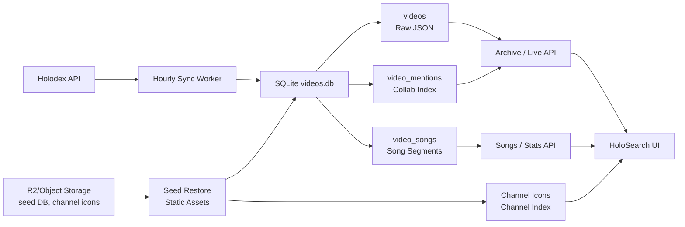

# Data Processing & Analysis Pipeline

HoloProject의 데이터 파이프라인은 Holodex API 응답을 그대로 화면에 뿌리는 구조가 아니라, 반복 조회가 많은 기능을 SQLite 기반 데이터 마트로 재구성하는 구조입니다. 라이브/예정, 아카이브, 노래 DB, 통계, 채널 인덱스는 서버가 보유한 DB와 정적 리소스 계층에서 제공합니다.

## 1. Pipeline Goal

| 목표 | 구현 방향 |
| --- | --- |
| API 과다 호출 방지 | 주요 화면을 DB-backed API로 전환 |
| 원본 보존 | Holodex raw JSON을 `videos.json_data`에 저장 |
| 반복 검색 최적화 | 멘션과 곡 구간을 별도 테이블로 정규화 |
| 운영 복구 단순화 | seed DB를 `SEED_DB_URL`로 복원하고 R2/object storage에 분리 |
| 정적 리소스 경량화 | 채널 아이콘을 `assets.holo-search.xyz` 같은 외부 자산 계층에서 제공 |

## 2. Data Flow



## 3. Storage Model

### 3.1 Raw Video Store

`videos` 테이블은 화면 조회와 분석에 공통으로 필요한 최소 컬럼을 두고, Holodex 원본 응답은 `json_data`에 보존합니다. 이 구조 덕분에 Holodex 응답 필드가 늘어나도 전체 마이그레이션 없이 필요한 값만 뒤늦게 파싱할 수 있습니다.

```sql
CREATE TABLE videos (
    id TEXT PRIMARY KEY,
    channel_id TEXT,
    title TEXT,
    type TEXT,
    topic_id TEXT,
    available_at TEXT,
    status TEXT,
    json_data TEXT
);
```

### 3.2 Normalized Read Models

반복 조회가 많은 필드는 raw JSON에서 매번 파싱하지 않고 별도 테이블로 내립니다.

| 테이블 | 역할 |
| --- | --- |
| `video_mentions` | 콜라보 멤버 OR/AND 검색과 관계 통계 |
| `video_songs` | Musicdex/Holodex `songs` 구간 검색과 노래 DB |
| `videos` indexes | 채널, 날짜, topic, status 기준 아카이브 조회 |

## 4. Sync Strategy

운영 서버는 Railway에서 동작하고, 자동 동기화는 1시간 주기(`AUTO_SYNC_INTERVAL_SECONDS=3600`)로 실행됩니다. 초기 부팅 시에는 `SEED_DB_URL`이 있으면 R2/object storage의 압축 seed DB를 내려받아 복구하고, 이후 증분 동기화가 최신 영상과 메타데이터를 보강합니다.

| 단계 | 설명 |
| --- | --- |
| Seed restore | 대용량 DB를 Git에 넣지 않고 외부 URL에서 복원 |
| Incremental sync | 최근 영상 중심으로 Holodex 데이터를 갱신 |
| Song extraction | `songs` 메타데이터가 붙은 영상의 곡 구간을 `video_songs`에 적재 |
| Mention extraction | `mentions` 배열을 `video_mentions`에 적재 |
| Channel index cache | 채널 목록과 아이콘 경로를 캐시해 초기 렌더링 비용 감소 |

## 5. Query Layer

프론트엔드는 Holodex API를 직접 여러 번 호출하지 않고, FastAPI가 제공하는 read API를 기준으로 화면을 구성합니다.

| 화면 | 데이터 출처 |
| --- | --- |
| 홈 | 채널 인덱스, DB 요약, 정적 아이콘 |
| 라이브 & 예정 | 서버 키 기반 Holodex 조회와 DB 보조 |
| 아카이브 | SQLite `videos` + `video_mentions` |
| 노래 DB | SQLite `video_songs` |
| 통계 | SQLite 집계 쿼리 |

아카이브, 노래, 통계처럼 반복 조회가 많은 기능은 DB에서 제공해 API 사용량과 응답 흔들림을 줄였습니다.

## 6. Derived Metrics

현재 서비스에서 산출하는 주요 지표는 다음과 같습니다.

| 지표 | 산출 방식 |
| --- | --- |
| 연도별 방송 수 | `available_at` 기준 연도 집계 |
| 월별 방송 수 | 선택 연도 내 월별 집계 |
| 멤버십 방송 추이 | `topic_id`와 제목 키워드 기반 보조 필터 |
| 콜라보 TOP 랭킹 | `video_mentions` 기준 빈도 집계 |
| 연도별 콜라보 | 멘션 테이블과 날짜 조건 결합 |
| 노래 DB 요약 | `video_songs`의 구간 수, 영상 수, 최신 갱신일 |

## 7. Operational Boundaries

노래 DB는 자체 음원 인식이 아니라 Holodex/Musicdex의 `songs` 메타데이터를 신뢰합니다. 따라서 원천 서비스에 곡 정보가 늦게 붙으면 HoloSearch 반영도 늦어질 수 있습니다. 이 한계는 최근 `singing` 영상 재조회 큐를 추가하면 보완할 수 있지만, 현재는 원천 메타데이터의 정확성을 우선합니다.
